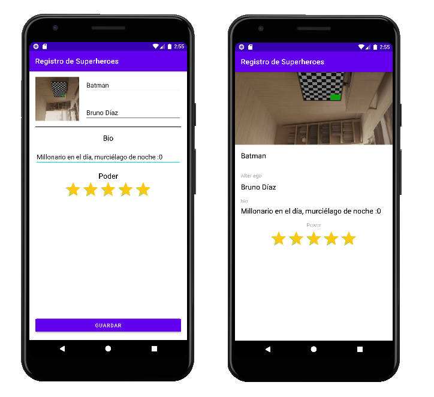

# Aplicación Registro de superhéroes

Esta aplicación hace un registro (no persistente) de un superhéroe, permite usar la cámara y mandar la imagen, junto con la demás información entre actividades. La aplicación usa el lenguaje <a href="https://kotlinlang.org/">Kotlin</a> y fue realizada en la IDE <a href="https://developer.android.com/studio">Android Studio</a>. A continuación se muestran las dos actividades que componen la aplicación:

Esta aplicación se realizó como parte del curso <a href="https://www.udemy.com/course/android-completo-con-kotlin/">Android Completo con Kotlin: Aprende creando apps</a>
